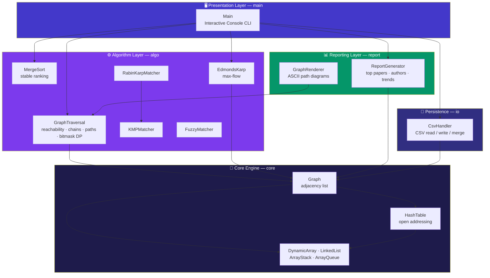
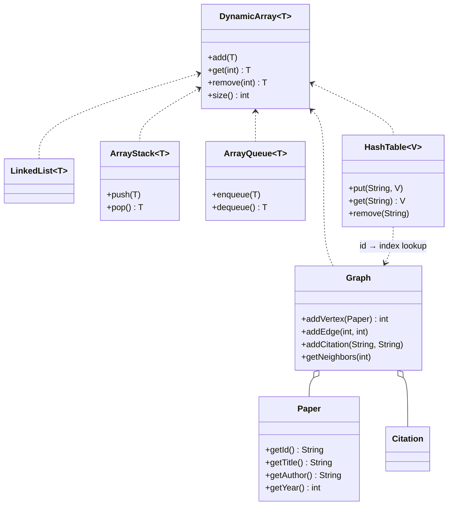
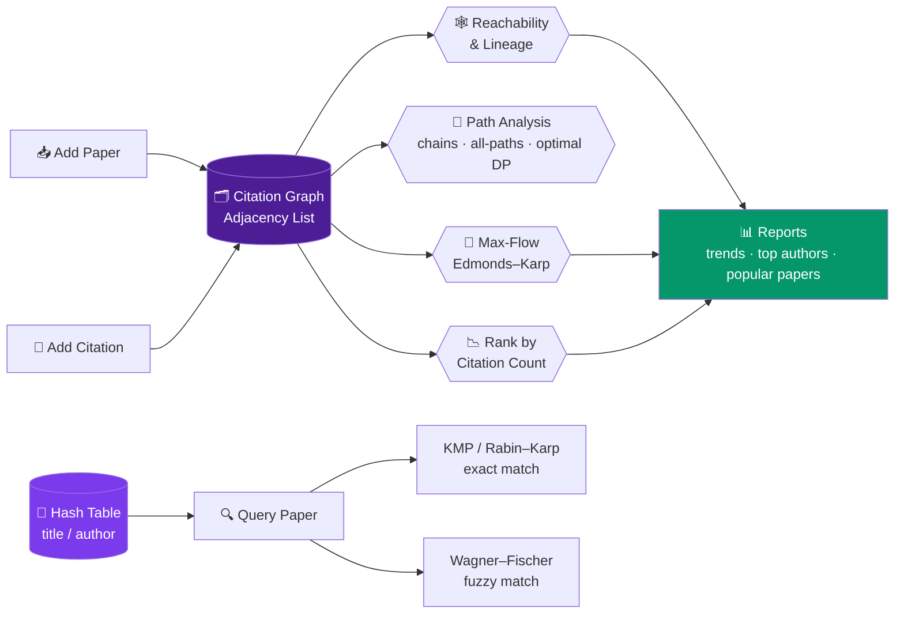
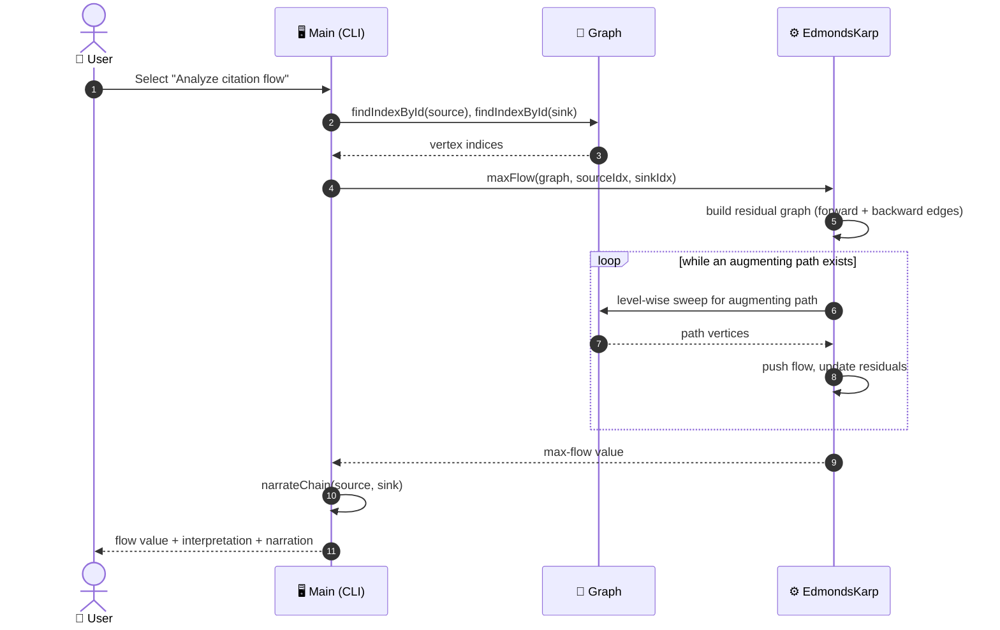
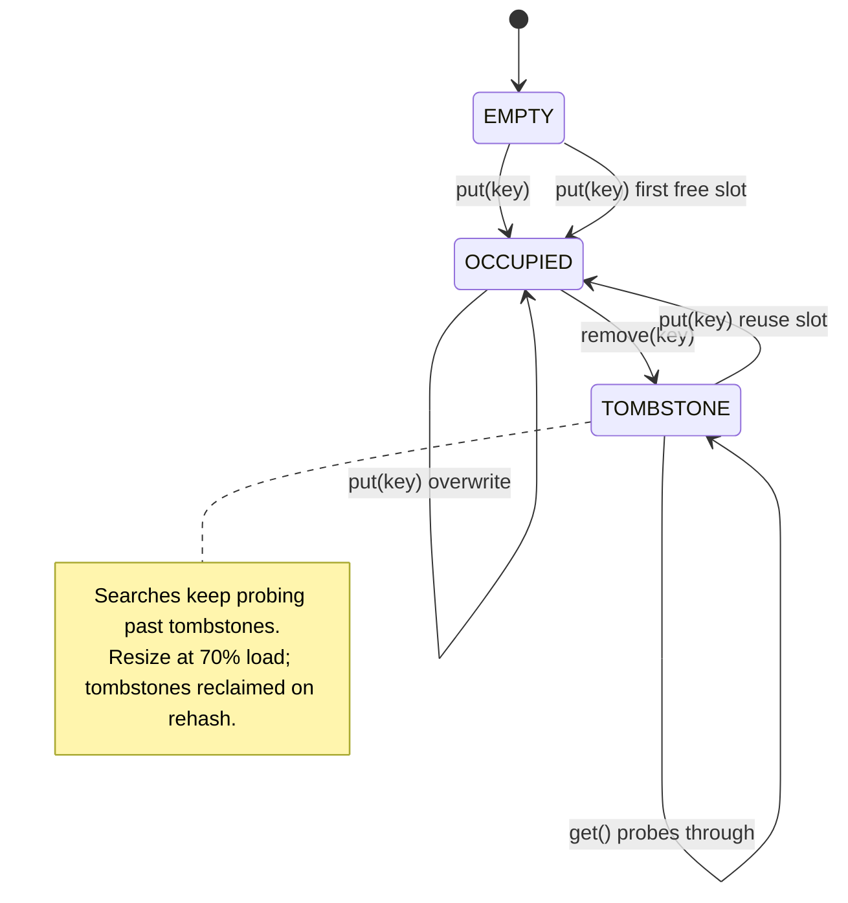

<div align="center">

```
 ██████╗███████╗██████╗ ██████╗ ███████╗██████╗ ██╗   ██╗███████╗
██╔════╝██╔════╝██╔══██╗██╔══██╗██╔════╝██╔══██╗██║   ██║██╔════╝
██║     █████╗  ██████╔╝██████╔╝█████╗  ██████╔╝██║   ██║███████╗
██║     ██╔══╝  ██╔══██╗██╔══██╗██╔══╝  ██╔══██╗██║   ██║╚════██║
╚██████╗███████╗██║  ██║██████╔╝███████╗██║  ██║╚██████╔╝███████║
 ╚═════╝╚══════╝╚═╝  ╚═╝╚═════╝ ╚══════╝╚═╝  ╚═╝ ╚═════╝ ╚══════╝
     S Y S T E M
```

### 🕸️ A Data Structures–Driven Approach to Tracking Academic Citations

*Every paper is a vertex. Every citation is a directed edge. Every algorithm here was hand-built, not imported.*

<br/>

[](https://www.oracle.com/java/)
[](.)
[](.)
[](.)

[](.)
[](.)
[](.)
[](LICENSE)

[](.)
[-1f6feb?style=flat-square&logo=windowsterminal&logoColor=white)](.)
[](.)
[](.)

<br/>

**📖 [Overview](#-overview) · ❗ [The Problem](#-the-problem) · ✨ [Features](#-features) · 🏗️ [Architecture](#-architecture) · ⚙️ [How It Works](#-how-it-works)**

**🧩 [Algorithm Map](#-module--algorithm-map) · 📐 [Complexity](#-complexity-cheat-sheet) · 📂 [Structure](#-project-structure) · 🚀 [Getting Started](#-getting-started)**

**🎮 [Console Menu](#-console-menu-reference) · 🗃️ [Data Format](#-data-format) · ✅ [Testing](#-testing) · 🗺️ [Roadmap](#-roadmap) · 👥 [Team](#-team)**

</div>

<br/>

---

## 🧠 Overview

Research literature grows through an ever-expanding web of citations — yet tracking **who cites whom**, spotting **influential work**, and navigating this network is still largely manual and unsystematic. Researchers deserve better than scattered spreadsheets and gut-feeling rankings.

**Citation Analysis System** turns scholarly literature into a **directed citation graph**, then unleashes hand-built algorithms on top of it to explore, rank, and interrogate that network.

<div align="center">

| Real World | → | Graph World | Algorithm |
|:---:|:---:|:---:|:---:|
| 📄 Research Paper | → | 🔵 Vertex | `Graph.addVertex()` |
| 🔗 *"Paper A cites Paper B"* | → | ➡️ Directed Edge `A → B` | `Graph.addCitation()` |
| 🔥 Highly cited paper | → | 🎯 High in-degree vertex | Merge Sort ranking |
| 🌊 Chain of scholarly influence | → | 💧 High-capacity flow path | Edmonds–Karp max-flow |
| 🧭 Shortest citation trail | → | 🛤️ Minimum-hop route | Level-order reconstruction |
| 🎯 Optimal tour of many papers | → | 🧮 Bitmask DP state | Held–Karp path DP |

</div>

> [!IMPORTANT]
> No frameworks doing the heavy lifting. No `java.util` collections in the core engine. Every graph, hash table, stack, queue, and search algorithm here is **hand-built from the ground up** — because that's the entire point of the exercise.

<br/>

## ❗ The Problem

Researchers currently lack a systematic, data-structure-driven way to:

- 🔍 **Track** citation relationships across papers
- ⭐ **Identify** influential / high-impact work
- 🌊 **Analyze** citation flow between authors or research clusters
- 🧭 **Plan** a citation trail that touches a whole set of papers

Most of this happens **manually or across siloed databases** — which slows down research discovery, causes redundant duplicate work, and lets genuinely seminal papers quietly go unnoticed amid scattered citation data.

<br/>

## ✨ Features

<div align="center">

| | Capability | What it does | Built with |
|:---:|---|---|---|
| ➕ | **Add papers & citations** | Register vertices and directed edges | Custom adjacency-list graph |
| 🔎 | **Search papers** | Exact substring + typo-tolerant matching | KMP · Rabin–Karp · Wagner–Fischer |
| 📉 | **Rank papers** | Stable top-N most-cited leaderboard | Hand-rolled merge sort |
| 🕸️ | **Explore reachability** | Level-wise horizon & deep lineage traversal | Custom queue + stack |
| 🧵 | **Narrate a chain** | Human-readable "A refers to B…" path story | Level-order parent tracking |
| 🔀 | **Enumerate all paths** | Every simple source→target route + Hamiltonian flag | Recursive backtracking (capped) |
| 🎯 | **Optimal citation path** | Cheapest tour visiting a whole set of papers | Held–Karp bitmask DP |
| 🌊 | **Analyze flow** | Max "influence flow" between clusters | Edmonds–Karp max-flow |
| 📊 | **Generate reports** | Trends, top authors, most-cited papers | Graph + hash-table aggregation |
| 💾 | **Persist** | Save / load / merge graph state | CSV via plain `java.io` |
| 🖼️ | **Render paths** | ASCII citation-path diagrams | Custom graph renderer |

</div>

<br/>

## 🏗️ Architecture

Five layers, strictly separated so the algorithms never depend on the presentation.



<details>
<summary><strong>🧱 Core engine — class relationships</strong></summary>

<br/>



</details>

<br/>

## ⚙️ How It Works



### 🔬 Anatomy of a flow analysis



### 🗄️ Hash-table slot lifecycle



<br/>

## 🧩 Module & Algorithm Map

<div align="center">

| Layer | Class | Role | Core algorithm |
|:---:|---|---|---|
| `core` | `DynamicArray` | Resizable backing store | Amortized `O(1)` append |
| `core` | `LinkedList` | Optional bucket chain | Singly linked list |
| `core` | `ArrayStack` / `ArrayQueue` | LIFO / FIFO frontiers | Array-backed |
| `core` | `HashTable` | ID → index lookup | Open addressing + linear probing + tombstones |
| `core` | `Graph` | Citation network | Adjacency list |
| `algo` | `GraphTraversal` | Reachability & paths | Level-wise & deep lineage, chain narration, all-paths, **Held–Karp bitmask DP** |
| `algo` | `MergeSort` | Ranking | Stable merge sort |
| `algo` | `KMPMatcher` | Exact substring | KMP failure function |
| `algo` | `RabinKarpMatcher` | Multi-pattern scan | Rolling hash |
| `algo` | `FuzzyMatcher` | Typo tolerance | Wagner–Fischer (2-row DP) |
| `algo` | `EdmondsKarp` | Influence flow | Augmenting paths on residual graph |
| `report` | `ReportGenerator` | Insights | Aggregation + ranking |
| `report` | `GraphRenderer` | Visualization | ASCII path diagrams |
| `io` | `CsvHandler` | Persistence | Two-section CSV parse/write |

</div>

<br/>

## 📐 Complexity Cheat Sheet

<details open>
<summary><strong>Click to expand the Big-O breakdown</strong></summary>

<br/>

<div align="center">

| Operation | Algorithm | Time | Space |
|---|---|:---:|:---:|
| Add paper / citation edge | Adjacency list insert | `O(1)` | `O(V + E)` |
| Traverse the network | Level-wise / deep lineage | `O(V + E)` | `O(V)` |
| Exact title / author search | Custom hash table | `O(1)` avg · `O(n)` worst | `O(n)` |
| Exact string pattern match | KMP | `O(n + m)` | `O(m)` |
| Multi-pattern search | Rabin–Karp | `O(n + m)` avg | `O(1)` |
| Fuzzy / typo-tolerant search | Wagner–Fischer | `O(m · n)` | `O(min(m, n))` |
| Citation-count ranking | Custom merge sort | `O(n log n)` | `O(n)` |
| Enumerate all simple paths | Backtracking (capped 10 000) | `O(V!)` worst | `O(V)` |
| Optimal tour of `k` papers | **Held–Karp bitmask DP** | `O(2ᵏ · k²)` | `O(2ᵏ · k)` |
| Citation-flow analysis | Edmonds–Karp | `O(V · E²)` | `O(V + E)` |
| Report aggregation | Sort + group | `O(V log V)` | `O(V)` |

</div>

*`V` = papers, `E` = citations, `n`/`m` = string lengths, `k` = papers requested in an optimal-path query (`k ≤ 20`).*

</details>

<br/>

## 📂 Project Structure

```text
CAS/
├── src/
│   ├── core/                    # 🧱 Foundation — zero java.util collections
│   │   ├── DynamicArray.java    #    resizable generic array
│   │   ├── LinkedList.java      #    linked list
│   │   ├── ArrayStack.java      #    LIFO frontier
│   │   ├── ArrayQueue.java      #    FIFO frontier
│   │   ├── HashTable.java       #    open addressing · tombstones · 0.7 resize
│   │   ├── Graph.java           #    directed adjacency-list citation graph
│   │   ├── Paper.java           #    vertex model
│   │   ├── Citation.java        #    edge model
│   │   ├── Consumer.java        #    functional callback helper
│   │   └── DataStructuresTest.java
│   ├── algo/                    # ⚙️ Algorithms — all hand-built
│   │   ├── GraphTraversal.java  #    reachability · chains · all paths · optimal DP
│   │   ├── MergeSort.java       #    stable ranking
│   │   ├── KMPMatcher.java      #    exact substring search
│   │   ├── RabinKarpMatcher.java#    rolling-hash search
│   │   ├── FuzzyMatcher.java    #    Wagner–Fischer edit distance
│   │   ├── EdmondsKarp.java     #    max-flow
│   │   └── *Test.java
│   ├── io/
│   │   └── CsvHandler.java      # 💾 CSV load / save / merge
│   ├── report/                  # 📊 Insights & rendering
│   │   ├── ReportGenerator.java
│   │   └── GraphRenderer.java
│   └── main/
│       └── Main.java            # 🖥️ interactive console application
├── research_papers/             # 📚 corpus, abstracts, full texts, survey
├── tools/                       # 🛠️ helper scripts
├── citation_data.csv            # 🗃️ default dataset (75 papers · 91 citations)
├── papers.csv
├── BUILD_PLAN.md                # 🗺️ architecture & phased plan
├── WALKTHROUGH.md               # 📘 deep-dive on the optimal-path feature
└── README.md
```

<br/>

## 🚀 Getting Started

### Prerequisites

<div align="center">

| Requirement | Version | Notes |
|---|:---:|---|
| ☕ JDK | **17 or newer** | Verified on Temurin 17.0.20 |
| 🧰 Build tool | **none** | Plain `javac` / `java` — no Maven, no Gradle |
| 📦 Dependencies | **none** | Pure standard library |
| 💻 Terminal | any | Git Bash, PowerShell, zsh, bash |

</div>

### Installation

```bash
# Clone the repository
git clone https://github.com/<your-username>/DSA-3_Projects.git
cd DSA-3_Projects

# Compile every source file into out/
find src -name '*.java' > /tmp/srcfiles.txt
javac -d out @/tmp/srcfiles.txt

# Run the console application
java -cp out main.Main
```

### Sample session

```text
========================================================================
                          CERBERUS SYSTEM (CS)
                 Pure Java Data Structures & Algorithms
========================================================================
Graph loaded with 75 research papers and 91 citation edges.

----------------------------- MAIN MENU --------------------------------
  1. Add a paper
  2. Add a citation
  ...
 12. Optimal Citation Path (Bitmask DP)
 13. Exit
------------------------------------------------------------------------
Enter your choice (1-13): 12

--- Optimal Citation Path (Bitmask DP) ---
Enter comma-separated paper IDs (e.g. P101,P102,P104): P102,P101,P104

=================== OPTIMAL CITATION PATH ===================
Papers requested : 3
Path             : P102 -> P101 -> P104 (total cost: 2)
Total cost       : 2
=============================================================
```

> 💡 **Tip:** the app auto-loads `citation_data.csv` on boot, so it's fully interactive the moment it starts.

<br/>

## 🎮 Console Menu Reference

<div align="center">

| # | Option | What it does |
|:---:|---|---|
| `1` | Add a paper | Register a new vertex (validated ID, title, author, year) |
| `2` | Add a citation | Record a directed edge `Paper A → Paper B` |
| `3` | Search a paper | Exact (KMP) or fuzzy (Wagner–Fischer) lookup |
| `4` | Explore reachability | Level-wise horizon or deep lineage traversal from a paper |
| `5` | Analyze citation flow | Edmonds–Karp max-flow between two papers |
| `6` | View reports | Top papers · top authors · yearly trends |
| `7` | Save to CSV | Persist current graph state |
| `8` | Load from CSV | Merge with, or replace, current data |
| `9` | View paper content | Open the paper's PDF, or fall back to text in-terminal |
| `10` | Narrate citation chain | Shortest-path story between two papers |
| `11` | Display all paths | Every simple route + Hamiltonian marking + ASCII diagram |
| `12` | **Optimal citation path** | Cheapest route visiting a whole set of papers (bitmask DP) |
| `13` | Exit | Quit (offers to save unsaved changes) |

</div>

<br/>

## 🗃️ Data Format

The dataset is a single two-section CSV: papers first, then citations.

```csv
# PAPERS
id,title,author,year,citationCount
P101,Attention Is All You Need,Ashish Vaswani et al.,2017,0
P102,BERT: Pre-training of Deep Bidirectional Transformers for Language Understanding,Jacob Devlin et al.,2018,0

# CITATIONS
citingPaperId,citedPaperId
P102,P101
P103,P101
P103,P102
P101,P104
```

- `id` is the primary key; the graph keeps an `id → vertex index` map in the custom hash table.
- Citation counts are recomputed from the edge list via `CsvHandler.syncCitationCounts(...)`.
- Quoted fields containing commas are supported.

<br/>

## ✅ Testing

Ten self-contained suites — each is a `main()` that prints a raw `passed / total` line and exits
non-zero on the first failure. No test framework required.

```bash
# Run a single suite
java -cp out algo.GraphTest

# Run everything
for t in algo.GraphTest algo.MaxFlowTest algo.MergeSortTest algo.StringMatchingTest \
         core.DataStructuresTest core.HashTableTest io.CsvTest \
         main.IntegrationEdgeCasesTest report.GraphRendererTest report.ReportTest; do
  echo "== $t"; java -cp out "$t" | grep "TEST RESULTS"
done
```

<div align="center">

| Suite | Assertions | Result |
|---|:---:|:---:|
| `core.DataStructuresTest` | 85 | ✅ 85 / 85 |
| `core.HashTableTest` | 158 | ✅ 158 / 158 |
| `algo.GraphTest` | 73 | ✅ 73 / 73 |
| `algo.MaxFlowTest` | 14 | ✅ 14 / 14 |
| `algo.MergeSortTest` | 40 | ✅ 40 / 40 |
| `algo.StringMatchingTest` | 33 | ✅ 33 / 33 |
| `io.CsvTest` | 28 | ✅ 28 / 28 |
| `main.IntegrationEdgeCasesTest` | 32 | ✅ 32 / 32 |
| `report.GraphRendererTest` | 30 | ✅ 30 / 30 |
| `report.ReportTest` | 36 | ✅ 36 / 36 |
| **Total** | **529** | **✅ 529 / 529 · 0 failures** |

</div>

```text
DataStructuresTest         █████████████████████ 85
HashTableTest              ████████████████████████████████████████ 158
GraphTest                  ██████████████████ 73
MaxFlowTest                ████ 14
MergeSortTest              ██████████ 40
StringMatchingTest         ████████ 33
CsvTest                    ███████ 28
IntegrationEdgeCasesTest   ████████ 32
GraphRendererTest          ████████ 30
ReportTest                 █████████ 36
                           ────────────────────────────────────────
                           10 suites · 529 assertions · 0 failures
```

<br/>

## 🧭 Design Principles & Constraints

<div align="center">

| # | Principle | Why it matters |
|:---:|---|---|
| 1 | **No `java.util` collections in core logic** | Every data structure is earned, not imported |
| 2 | **Zero third-party dependencies** | Compiles with nothing but the JDK |
| 3 | **No build tool** | `javac` + `java`, nothing else |
| 4 | **Read-only reporting** | Reports never mutate the graph or hash table |
| 5 | **No silent failures** | Bad input is rejected with a clear message |
| 6 | **Bounded work** | Path enumeration capped at 10 000; optimal-path capped at 20 papers |
| 7 | **Layered dependencies** | Presentation → algorithms → core; never the reverse |

</div>

<br/>

## 🗺️ Roadmap

- [x] 🧱 Core data structures (dynamic array, linked list, stack, queue)
- [x] 🗂️ Citation graph engine (adjacency list, reachability, lineage)
- [x] 🔎 Custom hash table with open addressing + tombstones
- [x] 🧵 KMP / Rabin–Karp exact search
- [x] ✏️ Wagner–Fischer fuzzy matching
- [x] 🧭 Chain narration & all-paths enumeration (Hamiltonian check)
- [x] 🌊 Edmonds–Karp max-flow citation analysis
- [x] 📉 Stable merge-sort ranking & reports
- [x] 🎯 Optimal citation path (Held–Karp bitmask DP)
- [x] 💾 CSV persistence (save / load / merge)
- [ ] 🖼️ Interactive visual graph explorer
- [ ] 📄 Export reports to PDF
- [ ] 📚 Bulk import (BibTeX / RIS)
- [ ] 🌐 Zero-dependency web front-end (hand-rolled HTTP + JSON)

<br/>

## 🤝 Contributing

1. 🌿 Branch from `main` — `feature/<short-name>`
2. 🧪 Keep the "no `java.util` collections, no dependencies" rule intact
3. ✅ Add assertions to the matching suite and keep it green
4. 📝 Describe the *why* in the PR body, not just the *what*

<br/>

## 👥 Team

<div align="center">

**Section 07 · Team 20 · DSA-3 (25CS2103E)**

| | Name | Roll Number |
|:---:|---|:---:|
| 👨💻 | **Bandla Vinay** | `2520030437` |
| 👨💻 | **Sai Sashank** | `2520030454` |
| 👨💻 | **Ganesh** | `2520030252` |

**Guide:** Dr. S. Madhavi

</div>

<br/>

## 📄 License

This project is built for academic purposes under **DSA-3 (25CS2103E)**. Licensed under [MIT](LICENSE) unless your course says otherwise — check with your guide before going full open-source rebel.

---

<div align="center">

**Built with directed edges, hand-rolled hash tables, and zero `java.util` shortcuts.**

⭐ *If this repo saved your grade, star it. That's the whole ask.*

`Java 17+` · `0 dependencies` · `10 suites` · `529 assertions`

</div>
