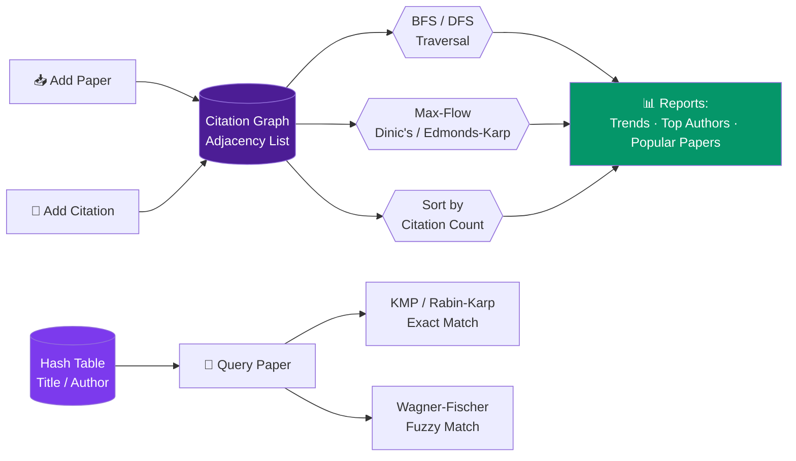
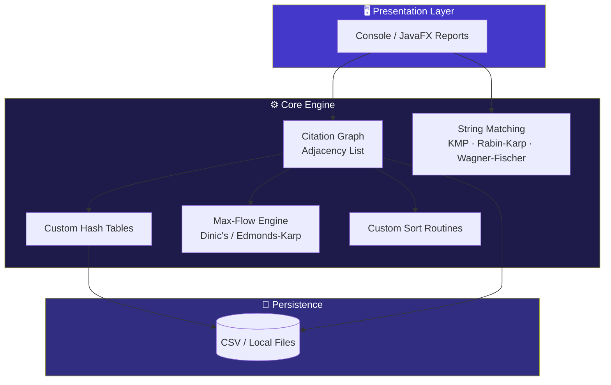

<div align="center">

```
 ██████╗██╗████████╗ █████╗ ████████╗██╗ ██████╗ ███╗   ██╗
██╔════╝██║╚══██╔══╝██╔══██╗╚══██╔══╝██║██╔═══██╗████╗  ██║
██║     ██║   ██║   ███████║   ██║   ██║██║   ██║██╔██╗ ██║
██║     ██║   ██║   ██╔══██║   ██║   ██║██║   ██║██║╚██╗██║
╚██████╗██║   ██║   ██║  ██║   ██║   ██║╚██████╔╝██║ ╚████║
 ╚═════╝╚═╝   ╚═╝   ╚═╝  ╚═╝   ╚═╝   ╚═╝ ╚═════╝ ╚═╝  ╚═══╝
     A N A L Y S I S   S Y S T E M
```

### 🕸️ A Data Structures–Driven Approach to Tracking Academic Citations

*Every paper is a vertex. Every citation is a directed edge. Every algorithm here was hand-built, not imported.*

<br>

[](https://www.oracle.com/java/)
[](.)
[](.)
[](LICENSE)
[](.)

<br>

**[Overview](#-overview) · [The Problem](#-the-problem) · [How It Works](#️-how-it-works) · [Architecture](#-architecture) · [Features](#-features) · [Tech Stack](#️-tech-stack) · [Complexity](#-complexity-cheat-sheet) · [Getting Started](#-getting-started) · [Roadmap](#️-roadmap) · [Team](#-team)**

</div>

<br>

---

## 🧠 Overview

Research literature grows through an ever-expanding web of citations — yet tracking **who cites whom**, spotting **influential work**, and navigating this network is still largely manual and unsystematic. Researchers deserve better than scattered spreadsheets and gut-feeling rankings.

**Citation Analysis System** fixes that by modeling scholarly literature as a **directed citation graph**:

<div align="center">

| Real World | → | Graph World |
|:---:|:---:|:---:|
| 📄 Research Paper | → | 🔵 Vertex |
| 🔗 "Paper A cites Paper B" | → | ➡️ Directed Edge (A → B) |
| 🔥 Highly cited paper | → | 🎯 High in-degree vertex |
| 🌊 Chain of scholarly influence | → | 💧 High-capacity flow path |

</div>

Once the graph exists, the system unleashes core graph algorithms to explore it — traversal, ranking, flow analysis, fast search — turning a tangled mess of academic cross-referencing into a **structured, queryable network**.

> [!IMPORTANT]
> No frameworks doing the heavy lifting. No `java.util` shortcuts. Every graph, hash table, and search algorithm here is **hand-built from scratch**, from the ground up — because that's the entire point of the exercise.

<br>

## ❗ The Problem

Researchers currently lack a systematic, data-structure-driven way to:

- 🔍 Track citation relationships across papers
- ⭐ Identify influential / high-impact work
- 🌊 Analyze citation flow between authors or research clusters

Most of this happens **manually or across siloed databases** — which slows down research discovery, causes redundant duplicate work, and lets genuinely seminal papers quietly go unnoticed amid scattered citation data.

<br>

## ⚙️ How It Works



| Capability | Algorithm(s) Used |
|---|---|
| 🔗 Add papers & record citation edges | Custom **adjacency-list graph** |
| 🔍 Traverse citation relationships | **BFS** & **DFS** |
| ⚡ Search papers by title/author | Custom **hash tables** (open addressing) — O(1) lookup |
| ✏️ Fuzzy / typo-tolerant search | **Wagner–Fischer edit distance** |
| 🧵 Exact string/pattern search | **KMP** & **Rabin–Karp** |
| 🌊 Citation-flow analysis between authors/clusters | **Dinic's / Edmonds–Karp max-flow** |
| 📊 Rank papers by citation count | Custom **sorting routines** |
| 📈 Generate trend & influence reports | Graph + hash-table aggregation |

The core insight driving the flow-analysis piece: a citation network is fundamentally a **flow of scholarly influence** — from source papers outward to the works that build on them. Strongly cited chains are treated as **high-capacity paths**, and max-flow techniques surface how influence actually moves through the network.

<br>

## 🏗️ Architecture



<br>

## ✨ Features

- ➕ **Add papers** and record directed citation relationships
- 🔎 **Search** via hashing, with edit-distance–based fuzzy matching for typos
- 📉 **Sort & rank** papers by citation count
- 🕸️ **Traverse** the citation graph (BFS/DFS) to reveal direct & indirect relationships
- 🌊 **Analyze citation flow** between authors or research clusters via max-flow
- 📑 **Generate reports** — citation trends, top authors, most-cited papers

<br>

## 🛠️ Tech Stack

<div align="center">

| Category | Tools |
|---|---|
| **Language** |  hand-built graph, hashing, string & flow algorithms |
| **Data Structures** | Custom adjacency-list graph · Custom hash tables |
| **Algorithms** | BFS/DFS · KMP · Rabin–Karp · Wagner–Fischer · Dinic's / Edmonds–Karp |
| **Data Storage** | CSV / local file-based persistence |
| **Dev Environment** |   |
| **Version Control** |  |
| **Testing** |  |
| **UI (optional)** | Console / JavaFX report views |

</div>

> [!WARNING]
> **No `java.util` collection classes** are used for core logic — every graph, hash table, and algorithm is implemented from scratch, consistent with the course's built-from-first-principles constraint.

<br>

## 📐 Complexity Cheat Sheet

<details>
<summary><strong>Click to expand the Big-O breakdown</strong></summary>

<br>

| Operation | Algorithm | Time Complexity | Space |
|---|---|:---:|:---:|
| Add paper / citation edge | Adjacency list insert | `O(1)` | `O(V + E)` |
| Traverse graph | BFS / DFS | `O(V + E)` | `O(V)` |
| Exact title/author search | Custom Hash Table | `O(1)` avg | `O(n)` |
| Fuzzy search (typo-tolerant) | Wagner–Fischer | `O(m·n)` | `O(m·n)` |
| Exact string pattern match | KMP | `O(n + m)` | `O(m)` |
| Multi-pattern search | Rabin–Karp | `O(n + m)` avg | `O(1)` |
| Citation-flow analysis | Dinic's | `O(V²·E)` | `O(V + E)` |
| Citation-count ranking | Custom Sort | `O(n log n)` | `O(n)` |

*`V` = papers, `E` = citations, `n`/`m` = string lengths.*

</details>

<br>

## 🚀 Getting Started

### Prerequisites
- JDK 17+
- IntelliJ IDEA or VS Code (with Java extensions)
- Git

### Installation

```bash
# Clone the repository
git clone https://github.com/<your-username>/citation-analysis-system.git
cd citation-analysis-system

# Build the project
javac -d out src/**/*.java

# Run
java -cp out Main
```

### Quick Usage

```
1. Add a paper        →  Register title, author(s), year
2. Add a citation      →  Link Paper A → Paper B (directed edge)
3. Search a paper       →  By exact title/author, or fuzzy match
4. Traverse            →  Run BFS/DFS from any paper
5. Analyze flow         →  Run max-flow between author clusters
6. Generate report       →  View top authors, popular papers, trends
```

<br>

## 🎯 Expected Outcome

- ✅ A functioning citation graph supporting full **BFS/DFS traversal**
- ✅ **Ranked citation counts** and automatic identification of top authors
- ✅ **Citation-trend reports** generated straight from graph + hash-table data
- ✅ A demonstrable **end-to-end search-and-analysis flow**, start to finish

This project proves that core DSA concepts — **graphs, hashing, and flow** — aren't just theory. They solve a real, practical academic research problem.

<br>

## 🗺️ Roadmap

- [x] Core graph engine (adjacency list, BFS/DFS)
- [x] Custom hash table for O(1) lookup
- [x] KMP / Rabin-Karp exact search
- [x] Wagner-Fischer fuzzy matching
- [x] Max-flow citation analysis
- [ ] JavaFX visual graph explorer
- [ ] Export reports to PDF
- [ ] Import bulk citation datasets (BibTeX)

<br>

## 👥 Team

<div align="center">

| Name | Roll Number |
|---|---|
| **Bandla Vinay** | 2520030437 |
| **Sai Sashank** | 2520030454 |
| **Ganesh** | 2520030252 |

**Section 07 · Team 20 · DSA-3 (25CS2103E)**
**Guide:** Dr. S. Madhavi

</div>

<br>

## 📄 License

This project is built for academic purposes under **DSA-3 (25CS2103E)**. Licensed under [MIT](LICENSE) unless your course says otherwise — check with your guide before going full open-source rebel.

---

<div align="center">

**Built with directed edges, hand-rolled hash tables, and zero `java.util` shortcuts.**

⭐ *If this repo saved your grade, star it. That's the whole ask.*

</div>
