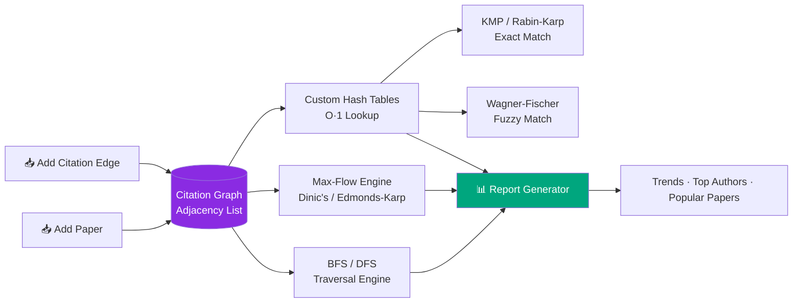

<div align="center">

```
   ██████╗██╗████████╗ █████╗ ████████╗██╗ ██████╗ ███╗   ██╗
  ██╔════╝██║╚══██╔══╝██╔══██╗╚══██╔══╝██║██╔═══██╗████╗  ██║
  ██║     ██║   ██║   ███████║   ██║   ██║██║   ██║██╔██╗ ██║
  ██║     ██║   ██║   ██╔══██║   ██║   ██║██║   ██║██║╚██╗██║
  ╚██████╗██║   ██║   ██║  ██║   ██║   ██║╚██████╔╝██║ ╚████║
   ╚═════╝╚═╝   ╚═╝   ╚═╝  ╚═╝   ╚═╝   ╚═╝ ╚═════╝ ╚═╝  ╚═══╝
        A N A L Y S I S   S Y S T E M
```

### Modeling the entire scholarly universe as a directed graph — one citation at a time.

<p>


</p>

<p>


</p>

**[Overview](#-overview) • [Architecture](#️-architecture) • [Features](#-features) • [Algorithms](#-algorithm-arsenal) • [Setup](#-getting-started) • [Team](#-team)**

</div>

---

## 🧠 Overview

Research literature grows through an **ever-expanding web of citations** — yet tracking who cites whom, spotting influential work, and navigating that network is still mostly manual, mostly scattered, and mostly a headache.

**Citation Analysis System** turns scholarly literature into something a machine can actually reason about: a **directed citation graph**.

<div align="center">

| Real World | → | Graph World |
|:---:|:---:|:---:|
| 📄 Research Paper | → | 🔵 Vertex |
| 🔗 "Paper A cites Paper B" | → | ➡️ Directed Edge |
| 🌟 Influential Paper | → | 🎯 High-indegree Node |
| Scholarly Influence Flow | → | 🌊 Max-Flow Path |

</div>

Once literature *is* a graph, everything downstream — traversal, ranking, flow, search — becomes a solved problem in disguise. That's the whole bet this project makes.

> 🚫 **No `java.util` collections for core logic.** Every graph, hash table, and search structure is hand-rolled from first principles. If it feels like cheating to use a built-in `HashMap`, we didn't.

---

## ❗ The Problem

Researchers currently have **no systematic, data-structure-driven way** to:

- 🔍 Track citation relationships across papers
- 📈 Identify influential / high-impact work
- 🌊 Analyze how citation "influence" flows between authors or research clusters

Today, this happens **manually, or scattered across siloed databases** — which:

- 🐌 Slows down research discovery
- 🔁 Causes redundant, duplicated work
- 🕳️ Lets genuinely seminal papers quietly go unnoticed

---

## 🏗️ Architecture



---

## ✨ Features

- ➕ **Add papers** and record directed citation relationships between them
- 🔎 **Search papers** by title/author via custom hashing — O(1) average lookup
- ✏️ **Fuzzy search** that tolerates typos using edit-distance matching
- 🕸️ **Traverse the graph** (BFS/DFS) to reveal direct *and* indirect citation relationships
- 📉 **Rank & sort** papers by citation count to surface influential work
- 🌊 **Analyze citation flow** between authors or research clusters via max-flow
- 📑 **Generate structured reports** — trends, top authors, most-cited papers

---

## 🧬 Algorithm Arsenal

<div align="center">

| Layer | Algorithm | Purpose | Complexity |
|---|---|---|---|
| **Graph Core** | Custom Adjacency-List Graph | Store papers & citation edges | O(V + E) space |
| **Traversal** | BFS | Shortest citation-path discovery | O(V + E) |
| **Traversal** | DFS | Deep relationship / cycle exploration | O(V + E) |
| **Flow Analysis** | Dinic's Algorithm | Citation-flow between clusters | O(V²·E) |
| **Flow Analysis** | Edmonds–Karp | Max-flow (BFS-based augmenting paths) | O(V·E²) |
| **Exact Search** | KMP | Fast substring/title matching | O(n + m) |
| **Exact Search** | Rabin–Karp | Rolling-hash pattern search | O(n + m) avg |
| **Fuzzy Search** | Wagner–Fischer | Edit-distance typo tolerance | O(n·m) |
| **Lookup** | Custom Hash Table (Open Addressing) | Constant-time paper retrieval | O(1) avg |
| **Ranking** | Custom Sort Routines | Citation-count based ranking | O(n log n) |

</div>

> **Why it matters:** a citation network is fundamentally a *flow of scholarly influence* — from source papers to the works that build on them. Strongly cited chains are treated as **high-capacity paths**, so max-flow isn't a gimmick here — it's the natural lens for the problem.

---

## 🛠️ Tech Stack

<div align="center">


</div>

---

## 📁 Project Structure

```
citation-analysis-system/
├── src/
│   ├── graph/
│   │   ├── CitationGraph.java       # Custom adjacency-list graph
│   │   ├── BFS.java
│   │   ├── DFS.java
│   │   └── MaxFlow.java             # Dinic's / Edmonds-Karp
│   ├── hashing/
│   │   ├── PaperHashTable.java      # Custom open-addressing hash table
│   │   └── UniversalHash.java
│   ├── search/
│   │   ├── KMP.java
│   │   ├── RabinKarp.java
│   │   └── WagnerFischer.java       # Edit-distance fuzzy matching
│   ├── model/
│   │   ├── Paper.java
│   │   └── Citation.java
│   ├── report/
│   │   └── ReportGenerator.java
│   └── Main.java
├── data/
│   └── papers.csv
├── test/
│   └── (JUnit test suites)
└── README.md
```

---

## 🚀 Getting Started

### Prerequisites
- JDK 17+
- IntelliJ IDEA or VS Code (Java extensions)
- Git

### Installation

```bash
# Clone the repository
git clone https://github.com/<your-username>/citation-analysis-system.git
cd citation-analysis-system

# Build
javac -d out src/**/*.java

# Run
java -cp out Main
```

### Quick Usage

```
1. Add a paper        →  Register title, author(s), year
2. Add a citation     →  Link Paper A → Paper B (directed edge)
3. Search a paper     →  Exact match, or fuzzy edit-distance match
4. Traverse           →  Run BFS/DFS from any paper node
5. Analyze flow       →  Run max-flow between author clusters
6. Generate report    →  View top authors, popular papers, trends
```

---

## 🗺️ Roadmap

- [x] Core graph + BFS/DFS traversal
- [x] Custom hash table for O(1) lookup
- [x] KMP / Rabin–Karp exact search
- [x] Wagner–Fischer fuzzy search
- [x] Max-flow citation analysis
- [ ] JavaFX visual graph explorer
- [ ] Export reports to PDF
- [ ] Multi-file CSV batch import

---

## 🎯 Expected Outcome

- ✅ A functioning citation graph supporting full **BFS/DFS traversal**
- ✅ **Ranked citation counts** and automatic identification of top authors
- ✅ **Citation-trend reports** generated straight from graph + hash-table data
- ✅ A demonstrable **end-to-end search-and-analysis flow**, start to finish

This project proves core DSA concepts — **graphs, hashing, and flow** — aren't just whiteboard theory. They solve a real academic research problem.

---

## 👥 Team

<div align="center">

| | Name | Roll Number |
|---|---|---|
| 🧑‍💻 | **Bandla Vinay** | 2520030437 |
| 🧑‍💻 | **Sai Sashank** | 2520030454 |
| 🧑‍💻 | **Ganesh** | 2520030252 |

**Section 07 · Team 20 · DSA-3 (25CS2103E)**
**Guide:** Dr. S. Madhavi

</div>

---

## 📄 License

Built for academic purposes under **DSA-3 (25CS2103E)**. Licensed under [MIT](LICENSE) — check with your guide before you go full open-source rebel with it.

---

<div align="center">

### ⭐ If this repo made your citation anxiety go away, drop a star.

**Built with directed edges, hand-rolled hash tables, and zero `java.util` shortcuts.**

</div>
